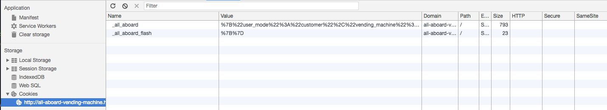

# All Aboard

Example (Vending Machine):
  * [Live](http://all-aboard-vending-machine.herokuapp.com/)
  * [Github](https://github.com/tomerovadia/VendingMachine)

## Overview

__All Aboard__ is a light-weight MVC web application framework. It provides structure for developers to create apps that communicate with web servers, receiving requests and preparing and delivering responses. It is modeled after Ruby on Rails.

The framework replicates the following Rails functionality:

  * Models
  * Views
    * [`Embedded RuBy (html.erb)`](https://ruby-doc.org/stdlib-1.9.3/libdoc/erb/rdoc/ERB.html)
  * Controllers
    * [ActiveController::Base](http://api.rubyonrails.org/classes/ActionController/Base.html)
    * [`render`](https://apidock.com/rails/ActionController/Base/render) and [`redirect_to`](http://api.rubyonrails.org/classes/ActionController/Redirecting.html)
    * Double render constraint
  * [Routes and Router](http://guides.rubyonrails.org/routing.html)
  * Cookies
    * [`Session`](http://guides.rubyonrails.org/security.html#session-storage) (e.g. `session[:value]`)
    * [`Flash & Flash.now`](http://guides.rubyonrails.org/action_controller_overview.html#the-flash)
  * Exception Handling
    * Error class, message and call stack
  * Static Assets
    * eg. Images, CSS, JavaScript

## Directory Structure

All Aboard operates with the following directory structure. The framework's logic lives in the `all_aboard` directory, which should not be accessed by the developer. Developers build their apps in the other folders: `app` and `config`.

  * all_aboard
    * templates
  * app
    * assets
    * controllers
    * models
    * views
  * config

## Server

Like Ruby on Rails, All Aboard uses Rack to standardize responses and requests to and from web servers. Rack is a gem available in Ruby -- All Aboard `require`s it in `server.rb`.

Rack provides `Rack::Request` and `Rack::Response` classes. All Aboard instantiates an instance of each -- saved to the variables `req` and `res`, respectively.

When `req` is instantiated, it is passed `env`, which equips `req` with information about the HTTP request, like HTTP method, params and url.

The variable `res` begins empty -- it is the responsibility of the app to populate it with a response.

All Aboard provides a clean, easy-to-use framework developers can use to understand users' requests (`req`) and populate responses (`res`).

Rack provides a method, `Rack::Server.start`, that starts a server and takes two arguments: `app` and `port`. Rack requires that `app` be any object that responds to `.call`. All Aboard accomplishes this using a Ruby [`Proc`](http://ruby-doc.org/core-2.0.0/Proc.html) object.

All Aboard then instantiates a `Router` (see below) and passes it the `req` and `res` objects.

```Ruby
# server.rb

...

app = Proc.new do |env|
  req = Rack::Request.new(env)
  res = Rack::Response.new

  router = AppRouter.draw_router
  router.run(req, res)

  res.finish
end

...


Rack::Server.start(
  app: app,
  Port: 3000
)
```

## Router and Routes

The All Aboard `Router` class stores multiple `Route`s that are defined by the developer in `config/routes.rb`. It has a `#run` method that takes the request and response Rack objects (`req` and `res`, provided by `server.rb`), finds the matched `Route` based on `req` and runs it. It returns a `404` error if no route is matched.

```Ruby
# router.rb

class Router

  ...

  def run(req, res)
    matched_route = match(req)

    if !matched_route
      res.status = 404
      res.write("No route matched #{req.path}")
    else
      matched_route.run(req, res)
    end

  end

end
```

While the routes are determined by the developer, the `Router` class defines methods the developer can use to declare routes. All Aboard currently supports `get`, `post`, `put` and `delete` routes.

To declare a route, developers use one of these four HTTP methods and pass as arguments:

  * a url pattern,
  * a controller class (e.g. `ItemsController`, `VendingMachinesController`) and
  * an action name (e.g. `show`, `destroy`).

```Ruby
# router.rb

class Router

  ...

  def add_route(pattern, method, controller_class, action_name)
    @routes.push(Route.new(pattern, method, controller_class, action_name))
  end

  ...

  [:get, :post, :put, :delete].each do |http_method|
    define_method(http_method) do |pattern, controller_class, action_name|
      add_route(pattern, http_method, controller_class, action_name)
    end
  end

end
```

All routes should be declared in the `config/routes.rb` file, which uses the `Router#draw` method to instantiate the `Route`s and add them to the `Router` as an instance variable. See below for an example. A template is provided out-of-the-box.

```Ruby
# example config/routes.rb
...

module AppRouter
  def draw_router

    router = Router.new

    router.draw do
      get Regexp.new("^/$"), VendingMachinesController, :show
      delete Regexp.new("^/vending-machines$"), VendingMachinesController, :destroy
      post Regexp.new("^/items$"), ItemsController, :create
      delete Regexp.new("^/items/(?<id>.+)$"), ItemsController, :destroy
    end

    router

  end
end
```

As in Ruby on Rails, a route determines which `Controller` `action` is responsible for developing a response to a given `HTTP verb` and `url`. The `Route` class provides a `#matched?` method that takes the request and returns a boolean indicating whether it matches the `HTTP verb` and `url`.

```Ruby
# router.rb

class Route

  def matches?(req)
    req.request_method.downcase == http_method.to_s && req.path =~ pattern
  end

end
```

Finally, if the `Router` finds a matching `Route` it calls `#run` on that `Route`.

`Route#run` instantiates a new instance of the matched route's Controller and invokes the Controller action indicated by the route. It also strips wildcard params (e.g. `/:id`) from the url path and passes them to the new Controller instance to use as it develops a response.

## Controller

As in Rails, the controllers provide developers an easy way to process HTTP requests and develop responses. Controllers have methods corresponding to actions defined in the routes (e.g. `show`, `index`, `create`, or custom routes) and utilize Models and Views to assist in this process.

All Aboard provides a `ControllerBase` class that all controllers inherit from (similar to Rails' `ActiveController::Base`).

`ControllerBase` gives every controller the `#render` and `#redirect_to` methods (among others), which are primarily responsible for loading the response data into the Rack response object, `res`. As in Rails, all controller actions should end in exactly one of these two methods. Calling more than one doesn't make sense and thus raises a double render exception.

### ControllerBase#render

The `ControllerBase#render` method takes the name of a `View` as an argument, locates the `View` in the `app/views` directory, transpiles the `html.erb` file to pure HTML and handles writing the resulting content to the body and header of the request object.

### ControllerBase#redirect_to

The `ControllerBase#redirect_to` method takes a url. It loads a status of `303` (redirect) and a `Location` header of the url onto the response object. Browsers are responsible for determining how to handle this request, but most react by dispatching a new HTTP request to the specified location, which completes the redirect.

## Views and Models

Views and models operate exactly as they do in Rails using built-in Ruby features, without additional logic provided by All Aboard (with the exception of `html.erb` transpilation in the controllers). Developers can add logic to views using ERB tags (`<=% %>` as well as `<% %>`). All Ruby features are available in the models, which are standard Ruby files.

## Cookies

Like Ruby on Rails, All Aboard provides `Session` and `Flash` cookies for developers to persist data between HTTP requests. This data is stored on the user's browser and sent back to the application with every HTTP request.

See the [Vending Machine example](http://all-aboard-vending-machine.herokuapp.com/), which persists data between sessions using the `Session` cookie.

All Aboard has `Session` and `Flash` classes that are instantiated for each HTTP request. They store the cookie data in instance variables. If a user making a request had an All Aboard cookie, its data is loaded onto these instance variables.

The `ControllerBase` class then has `#session` and `#flash` methods that expose the `Session` and `Flash` classes and their instance methods to all controllers, allowing them to read from or write to the cookies. When these methods are first called, they instantiate a `Session` or `Flash` instance.

Instance variables available from the `Sesssion` and `Flash` classes are: `[]` (getter), `[]=` (setter) and `store_flash`/`store_session`. The store methods load the cookie data onto the response object. They are called in the controller `#render` and `#redirect_to` methods since these methods complete a controller action. This also ensures that an instance of both `Session` and `Flash` are always instantiated for each request (even if not instantiated manually by the user).

```Ruby
# session.rb

class Flash

  ...

  def store_flash(res)
    # res.delete_cookie(:_all_aboard_flash)
    res.set_cookie(:_all_aboard_flash, {path: '/', value: @new_flash.to_json})
  end

end
```

When a request is passed to the user, the browser stores the request's cookie. In Chrome, this is visible in the Chrome Developer tools. The `value` is a stringified JSON object.



As in Rails, All Aboard provides a `flash` cookie that only persists for a single subsequent HTTP response cycle. This is useful for several purposes, such as flashing errors or passing data across a redirect. The `Flash` class stores separate `@old_flash` and `@new_flash` instance variables -- both are necessary to allow developers access to the flash cookie from the previous cycle (if it exists) as well as a fresh flash to be persisted to the next cycle.

All Aboard replicates Rails' `Flash.now` functionality. This feature isn't really a cookie -- its data is not passed back to the user and is only available for the life of the controller (i.e. a single HTTP request). The `Flash` class exposes a `now` instance variable with `attr_accessor` methods, which allow developers to use `flash.now` (getter) and `flash.now =` (setter) to store data.

## Middleware

All Aboard passes two additional middleware to Rack: `ShowExceptions` and `Static`.

### ShowExceptions

The `ShowExceptions` middleware wraps the web application in Ruby's `begin`/`rescue` block to prevent raw Internal Server Errors from being passed to the developer or user. It intercepts failed server logic, prepares the exception class, message and call trace in HTML and loads it onto the response body. The result is a more useful, informative and readable error message that helps developers debug.


### Static Assets

HTTP requests often retrieve files other than HTML (e.g. CSS files or images). This may be requested by the user directly (e.g. typing a path to the asset in a browser) or, more commonly, within HTML (e.g. `src` property of an `` tag or `href` property of a `<link>` tag).

All Aboard includes `Static` middleware that makes this possible. It intercepts HTTP requests before they are passed to the `Router` and discerns whether the request path includes `/assets/.` If not, it does not intervene and calls the next middleware (the application itself). If so, it follows the path to check if the asset exists. If not, it returns a `404` error. If so, it reads the file and writes it to the response body.

Note: The `Static` middleware only looks for assets in the `app/assets/` directory. All assets must be placed here.
